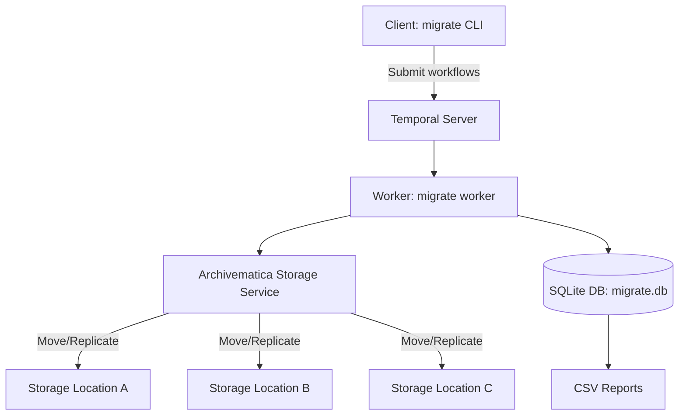

# Migrate

**Migrate** is a command-line tool for orchestrating large-scale **Archivematica
AIP migrations**. It automates the process of **moving and replicating AIPs**
between Archivematica Storage Service locations, e.g. migrating AIPs from
on-premises storage into DuraCloud while keeping a local replica set.

## Why use this tool?

Archivematica’s Storage Service already supports moving and replicating AIPs,
but running those operations at **scale** (tens of thousands of AIPs) is:

- **Slow and error-prone** if done manually
- **Hard to resume** if interrupted
- **Lacking visibility** into what has succeeded or failed

**Migrate** solves these problems by adding a durable orchestration layer:

- **Move and replicate AIPs** between Storage Service locations
- **Batch processing** from a simple UUID list (`input.txt`)
- **Reliable orchestration** with [Temporal] so workflows survive crashes and
  restarts
- **State tracking** in a local SQLite database (`migrate.db`)
- **Parallel execution** across multiple workers
- **CSV reports** (`move-report.csv`, `replication-report.csv`) for QA,
  auditing, and compliance

In short: give it a list of AIPs, and Migrate will orchestrate every move and
replication reliably until the job is done.

## Why is this not part of Storage Service?

Because Storage Service was never designed to be a workflow engine. It can move
and replicate AIPs, but it has no durable queue, no orchestration layer, and no
good way to resume or audit thousands of operations. It works for one-off jobs,
but at scale it becomes brittle.

Migrate fills that gap: it wraps Storage Service operations in durable Temporal
workflows, adding the missing layer of **scale, reliability, and reporting**
that Storage Service can't provide on its own. Over time, we expect new
approaches to emerge for large-scale digital preservation workflows, but today
Migrate is the practical tool to get the job done.

## How it works

Migrate separates **preparation**, **command submission**, and **execution**:

- **Preparation (`migrate load-input`)**:
  Reads UUIDs from `input.txt`, inserts them into the local SQLite database,
  queries Storage Service for their metadata, and produces an initial report.
  This gives you a baseline snapshot of AIP states before running long
  migrations.

- **Command submission (`migrate replicate` / `migrate move`)**:
  The client submits one workflow per AIP to Temporal.

- **Execution (`migrate worker`)**:
  Workers pick up tasks and execute them: talk to the Storage Service API,
  request move or replication operations, check fixity, and update the
  database.

- **Tracking & reporting (`migrate export`)**:
  The database keeps a durable record of every AIP’s state. At any time you can
  generate CSV reports to monitor progress or validate results.

The following diagram illustrates the basic architecture:



## Prerequisites

- Access to an **Archivematica Storage Service** instance with valid API
  credentials.

- A running **Temporal Server**:

  1. **Production-ready deployment (recommended):**

     Connect to a server already maintained by your organization, use [Temporal
     Cloud], or deploy your own cluster by following the [production deployment
     guide]. Be aware that operating and maintaining your own cluster adds
     substantial complexity to your setup.

  2. **Local development (quick start):**

     Start a lightweight development server with the [Temporal CLI]:

         temporal server start-dev --db-filename ./temporal.db

- Install Migrate: prebuilt packages are available from the [releases page].

## Configuration

### 1. Create a configuration file

Copy the provided [config.example.json] to `config.json` and adjust the values
for your environment. The application looks for `config.json` in several
locations, in this order:

1. The current working directory
2. The directory containing the `migrate` binary
3. `$XDG_CONFIG_HOME/migrate` (or `%AppData%\migrate` on Windows)
4. Your home directory

The first readable file found wins. The parser accepts standard JSON, but also
supports comments and trailing commas via [HuJSON].

### 2. Create input file

Create an `input.txt` file containing the UUIDs of AIPs you want to process
(one UUID per line):

```console
12345678-1234-1234-1234-123456789abc
87654321-4321-4321-4321-cba987654321
abcdef01-2345-6789-abcd-ef0123456789
```

If you need to trim an existing UUID list before loading it, use the
`migrate list-filter` subcommand. Place `original_list.txt` and
`to_filter_out.txt` in the current directory, run `migrate list-filter`, and
then use the generated `final_list.txt` as your filtered list.

### 3. Load input file

```bash
migrate load-input
```

This validates the UUIDs in `input.txt` and initializes them in the database.

### 4. Start worker process

```bash
migrate worker
```

This starts a worker process that handles Temporal workflows. Keep this
running in a separate terminal.

### 5. Move or replicate AIPs

At this point, you can either `replicate` or `move` AIPs.

The following command starts the replication process for AIPs to the configured
replication locations:

    migrate replicate

On the other hand, to move AIPs from source to destination, run:

    migrate move

### 6. Export results

Generate CSV reports for move or replication workflows:

    migrate export move
    migrate export replicate

Each command writes the corresponding report (`move-report.csv` or
`replication-report.csv`) with the latest status for every AIP.

[Temporal]: https://temporal.io
[Temporal CLI]: https://docs.temporal.io/cli/setup-cli
[Temporal Cloud]: https://temporal.io/cloud
[production deployment guide]: https://docs.temporal.io/production-deployment
[releases page]: https://github.com/artefactual-labs/migrate/releases
[config.example.json]: ./config.json.example
[HuJSON]: https://github.com/tailscale/hujson
